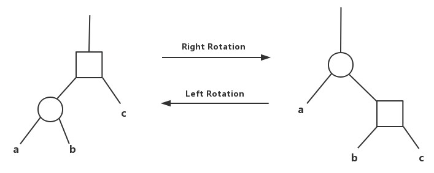
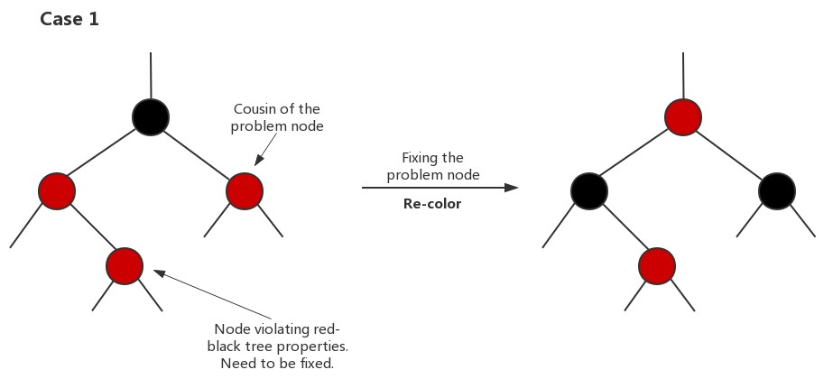
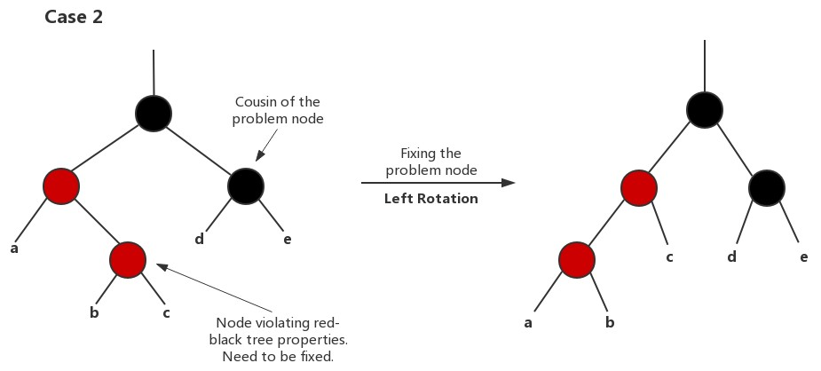
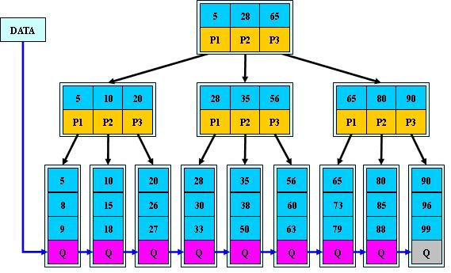
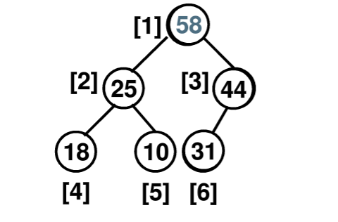
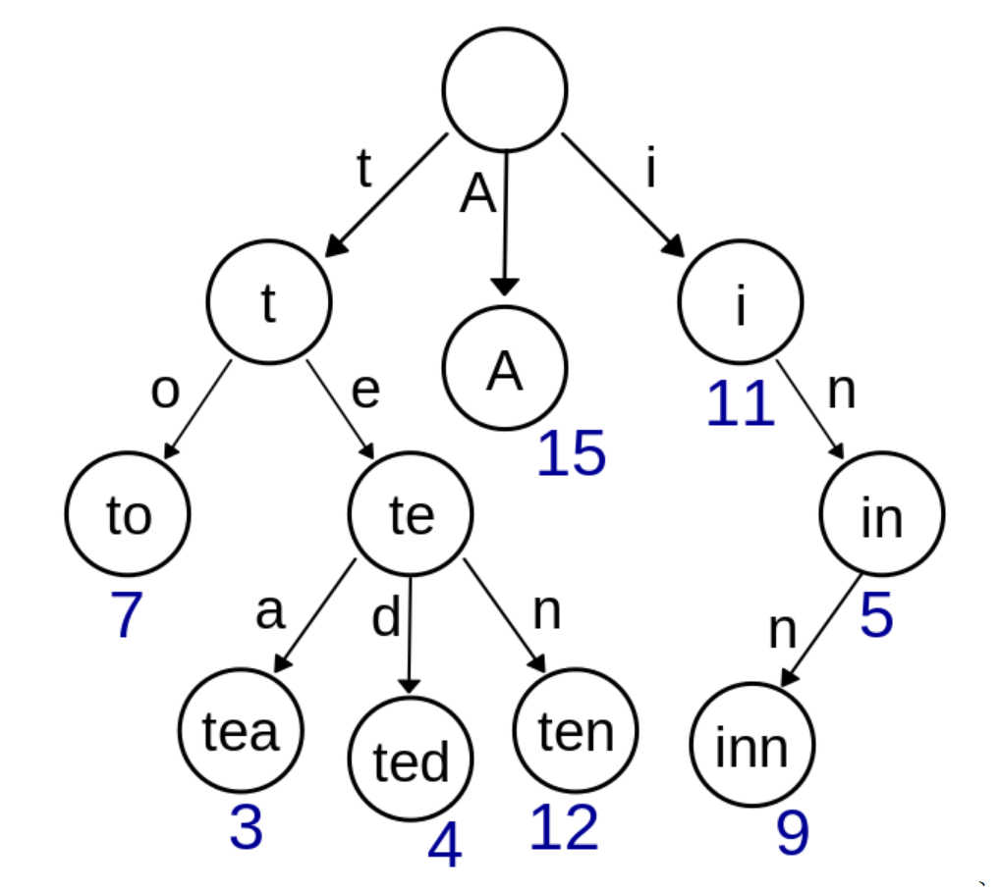

# Data Structure

## Array

### 功能实现

使用 Python 的 List（列表）实现：

```py
class Array:
    def __init__(self, x):
        self.data = list(x)

array1 = Array([1,2,3])
```

- size() —— 数组元素的个数
  
  ```py
    def size(self):
      return len(self.data)
  ```

- is_empty() —— 判断数组是否为空
  
  ```py
  def is_empty(self):
      return True if not self.data else False
      # other ways: 1. self.data == [] ; 2. len(self.data) == 0
  ```

- at(index) —— 返回对应索引的元素，若越界则报错
  
  ```py
  def at(self,index):
      if index >= len(self.data):
          raise IndexError("Array index out of range.")
      return self.data[index]
  ```

- push(item) —— 在数组末尾插入元素
  
  ```py
  def push(self,item):
      self.data.append(item)
  ```

- insert(index, item) —— 在指定索引中插入元素，并把后面的元素依次后移
  
  ```py
  def insert(self, index, item):
      self.data.insert(index, item)
  ```

- pop() —— 删除在数组末端的元素，并返回其值
  
  ```py
  def pop(self):
      return self.data.pop()
  ```

- delete(index) —— 删除指定索引的元素，并把后面的元素依次前移
  
  ```py
  def delete(self,index):
      self.data.pop(index)
  ```

- remove(item) —— 删除指定值的元素，并返回其索引（即使有多个元素）
  
  ```py
  def remove(self, item):
      index_list = []
      item_count = self.data.count(item)
      for i in range(item_count):
          index_list.append(self.data.index(item))
          self.data.remove(item)
      return index_list
  ```

- find(item) —— 寻找指定值的元素并返回其中第一个出现的元素其索引，若未找到则返回 -1
  
  ```py
  def find(self, item):
      if item in self.data:
          return self.data.index(item)
      else:
          return -1
  ```

- reverse() —— 翻转数组
  
  ```py
  def reverse(self):
      temp = []
      size = len(self.data)
      for i in range(size):
          temp.append(self.data[size-1-i])
      self.data = temp
  ```

- sort() —— 数组排序（升序） O(nlogn)
  
  ```py
  def sort(self):
      return self.data.sort()    # self.data.sort(reverse = True) 为降序 
  ```

### 时间复杂度：

- 在数组的**末尾插入/删除**、**更新**、**获取**某个位置的元素，都是 O(1) 的时间复杂度
- 在数组的任何其它地方**插入/删除**元素，都是 O(n) 的时间复杂度
- 空间复杂度：O(n)

## Linked List

### 实现

单向链表:

```py
class listNode:        # 链表中的结点
    def __init__(self, x):
        self.val = x
        self.next = None

class LinkedList:        # 链表类
    def __init__(self):
        self.head = None

l1 = LinkedList()
l1.add(1)
l1.add(2)
```

- size() —— 返回链表中数据元素的个数/链表长度
  
  ```py
  def size(self):
      size = 0
      head = self.head
      while head:
          size += 1
          head = head.next
      return size
  ```

- empty() —— 若链表为空则返回一个布尔值 true
  
  ```py
  def empty(self):
      return True if self.head else False
  ```

- value_at(index) —— 返回第 n 个元素的值（从0开始计算），若索引超过链表长度则报错
  
  ```py
  def value_at(self, index):
      if not self.head:
          raise IndexError("Index out of range.")
      head = self.head
      while index > 0:
          if not head:
              raise IndexError("Index out of range.")
          head = head.next
          index -= 1
      return head.val
  ```

- add(value) —— 添加元素到链表的首部
  
  ```py
  def add(self, value):
      new_node = listNode(value)
      new_node.next = self.head
      self.head = new_node
  ```

- pop_front() —— 删除首部元素并返回其值，若链表为空则报错
  
  ```py
  def pop_front(self):
      if not self.head:
          raise IndexError("Pop from empty list")
      value = self.head.val
      self.head = self.head.next
      return value
  ```

- append(value) —— 添加元素到链表的尾部
  
  ```py
  def append(self, value):
      new_node = listNode(value)
      if not self.head:
          self.head = new_node
          return
      head = self.head
      while head.next:
          head = head.next
      head.next = new_node
  ```

- pop_back() —— 删除尾部元素并返回其值，若链表为空则报错
  
  ```py
  def pop_back(self):
      if not self.head:
          raise IndexError("Pop from empty list")
      if not self.head.next:
          value = self.head.val
          self.head = None
          return value
      head = self.head
      while head.next.next:
            head = head.next
      value = head.next.val
      head.next = None
      return value
  ```

- front() —— 返回首部元素的值，若链表为空则报错
  
  ```py
  def front(self):
      if not self.head:
          raise ValueError("Linked list is empty")
      return self.head.val
  ```

- back() —— 返回尾部元素的值，若链表为空则报错
  
  ```py
  def back(self):
      if not self.head:
          raise ValueError("Linked list is empty")
      head = self.head
      while head.next:
            head = head.next
      return head.val
  ```

- insert(index, value) —— 插入值到指定的索引，若索引超出链表长度则报错
  
  ```py
  def insert(self, index, value):
      if not self.head:
          raise IndexError("Index out of range")
      head = self.head
      new_node = listNode(value)
      if index == 0:
          new_node.next = head
          self.head = new_node
          return
      while index - 1 > 0:
          head = head.next
          if not head:
              raise IndexError("Index out of range")
          index -= 1
      temp = head.next
      head.next = new_node
      new_node.next = temp
  ```

- erase(index) —— 删除指定索引的节点，若索引超出链表长度则报错
  
  ```py
  def erase(self, index):
      if not self.head:
          raise IndexError("Index out of range")
      head = self.head
      if index == 0:
          self.head = head.next
      while index - 1 > 0:
          index -= 1
          head = head.next
          if not head:
              raise IndexError("Index out of range")
      temp = head.next
      head.next = temp.next
  ```

- reverse() —— 逆序链表
  
  ```py
  def reverse(self):
      prev = None
      head = self.head
      while head:
          temp = head.next
          head.next = prev
          prev = head
          head = temp
      self.head = prev
  ```

- remove(value) —— 删除链表中指定值的第一个元素
  
  ```py
  def remove(self,value):
      if not self.head:
          return
      head = self.head
      if head.val == value:
          self.head = head.next
          return
      while head.next:
          if head.next.val == value:
              temp = head.next.next
              head.next = temp
              return
          head = head.next
  ```

### 时间复杂度：

- 在链表的**首部插入/移除结点**、获得**链表首部的值**，都是O(1)时间复杂度
- 获取/移除/插入任一结点、尾部结点，都是O(n)时间复杂度

## Stack

### 操作实现

使用数组实现栈（使用 Python 的 list 实现）：

```py
class Stack:
    def __init__(self):
        self.data = []

s1 = Stack()
s1.push(1)
s1.push(2)
```

- push(item) —— 向栈顶添加元素
  
  ```py
  def push(self, item):
      self.data.append(item)
  ```

- pop() —— 弹出栈顶的元素，若栈为空则报错
  
  ```py
  def pop(self):
      if self.data:
          return self.data.pop()
      else:
          raise PopError("Pop from empty stack.")
  ```

- peek() —— 返回栈顶的元素（但是不弹出），若栈为空则报错
  
  ```py
  def peek(self):
      if self.data:
          return self.data[-1]
      else:
          raise IndexError("Stack is empty.")
  ```

- size() —— 返回栈的长度

- is_empty() —— 判断栈是否为空

### 介绍

栈也叫堆栈（这里面的堆不是数据结构的堆）栈满足**后进先出 LIFO**的原则，时间复杂度：压栈、出栈都是 O(1)

## Queue

### 单链队列实现

使用 Python 中的列表 List 实现：

- enqueue(item) —— 将一个元素入队（在队尾添加元素）
  
  ```py
  def enqueue(self, item):
      self.data.append(item)
  ```

- dequeue() —— 将队首的元素出队，若队列为空则报错
  
  ```py
  def dequeue(self):
      if self.data:
          return self.data.pop(0)
      else:
          raise DequeueError("Queue is empty.")
  ```

- size() —— 返回队列长度

- is_empty() —— 判断队列是否为空

### 介绍

队列满足**先进先出 FIFO** 的原则。时间复杂度：出队列使用了列表的 ```pop(0)``` 方法，故时间复杂度为 O(n)；入队列采用了列表的 ```append()``` 方法，故时间复杂度为 O(1)

采用**循环队列（Circular Queue）**，可以将出队和入队的时间复杂度都降到 O(1)。循环队列有一个最大长度```max_size```，仍然采用列表实现。两个成员变量```front```和```rear```分别为队首元素和下一个入队的元素在列表中的索引。为了区别队列为空和队列为满，列表大小应为```length = max_size + 1```，列表中最多只能有```max_size```个队列元素。

当进行入队操作时，先**判断队列是否已满**：**(rear + 1) % length == front**，一种方法是已满直接报错，另一种是若队列已满则扩容为原来的两倍。入队时，```rear = (rear + 1) % max_size```

进行出队操作时，先**判断队列是否为空**：**front == rear**，如果为空则报错。出队时，```front = (front + 1) % max_size```

获得**当前队列长度**：**(rear - front + length) % length**

使用循环队列的方法，由于入队和出队操作都是直接通过索引访问列表，所以时间复杂度都是 O(1)

### 循环队列

```py
class CircularQueue:
    def __init__(self, max_size = 6):
        self.data = [None]*(max_size+1)
        self.front = 0
        self.rear = 0
```

- get_max_size() —— 获得队列的最大长度
  
  ```py
  def get_max_size(self):
      return len(self.data) - 1
  ```

- enqueue_strict(item) —— 入队操作，如果队列已满则报错
  
  ```py
  def enqueue_strict(self, item):
      if (self.rear+1) % len(self.data) == self.front:
          raise SizeError("Queue is full. Unable to enqueue.")
      self.data[self.rear] = item
      self.rear = (self.rear+1) % len(self.data)
  ```

- dequeue_strict() —— 出队操作，如果队列为空则报错
  
  ```py
  def dequeue_strict(self):
      if self.front == self.rear:
          raise SizeError("Queue is empty. Unable to dequeue.")
      item = self.data[self.front]
      self.data[self.front] = None
      self.front = (self.front + 1) % len(self.data)
  ```

- enqueue(item) —— 入队操作，如果已满则扩容为原来队列大小的两倍再入队
  
  ```py
  def enqueue(self, item):
      if (self.rear+1) % len(self.data) == self.front:
          self.resize(self.get_max_size() * 2)
      self.data[self.rear] = item
      self.rear = (self.rear+1) % len(self.data)
  ```

- dequeue() —— 出队操作，检测如果队列大小等于列表大小的1/4，并且列表大小大于等于2，则减小列表大小为原来的一半以节省空间开销
  
  ```py
  def dequeue(self):
      if self.front == self.rear:
          raise SizeError("Queue is empty. Unable to dequeue.")
      item = self.data[self.front]
      self.data[self.front] = None
      self.front = (self.front + 1) % len(self.data)
      if self.size() == self.get_max_size()//4 and len(self.data) >= 2:
          self.resize(self.get_max_size() // 2)
      return item
  ```

- size() —— 返回队列的当前大小
  
  ```py
  def size(self):
      return (self.rear - self.front + len(self.data)) % len(self.data)
  ```

- is_empty() —— 判断队列是否为空
  
  ```py
  def is_empty(self):
      return self.front == self.rear
  ```

## Binary Tree

### 基本概念

- 结点、父结点、子结点、兄弟结点；结点的度：结点的子树个数
- 层数、深度、高度、结点的度
- 满二叉树：除了叶结点，其它所有结点都有两个子结点（国内定义：除最后一层全为叶结点外，其它的层的每个结点都有两个子结点）
- 完全二叉树：除最后一层外，其它层全满，最后一层的叶结点必须从左到右填满

### 二叉树的遍历

```py
class treeNode:
    def __init__(self, x):
        self.val = x
        self.left = None
        self.right = None
```

- 深度优先搜索（Depth First Search, DFS）（非递归的版本在完整代码中）
  
     - 前序遍历 PreOrder Traversal：根-左结点-右结点
       
       ```py
       def preorder(root):
           if root is None:
               return []
           return [root.val] + preorder(root.left) + preorder(root.right)
       ```
  
     - 中序遍历 InOrder Traversal：左结点-根-右结点
  
     - 后序遍历 PostOrder Traversal：左结点-右结点-根

- 广度优先搜索（Breadth First Search, BFS）
  
     - 层次遍历 LevelOrder Traversal
       
       ```py
       def level_order(root):
           if not root:
               return []
           res = []
           nodequeue = [root]
           while nodequeue:
               root = nodequeue.pop(0)
               res.append(root.val)
               if root.left:
                   nodequeue.append(root.left)
               if root.right:
                   nodequeue.append(root.right)
           return res
       ```

**时间复杂度**：需要遍历每个结点，故为O(n)

**空间复杂度**：由于每个结点都要先进行存储再弹出，故空间复杂度为O(n)

- 二叉树的后序遍历，非递归版本：非递归的后序遍历是 hard 难度，所以专门在这里写一下。有下面几种思路：
  
     - 前序遍历是“根-左-右”，稍微改一下，就可以变成“根-右-左”，而将最后的结果倒序输出，就是后序遍历“左-右-根”的顺序了。时间复杂度依然为 O(n)：
       
       ```py
       def postorder_wh1(root):
           if root is None:
               return []
           res = []
           nodestack = []
           while nodestack or root:
               if root:
                   res.append(root.val)
                   nodestack.append(root)
                   root = root.right
               else:
                   root = nodestack.pop()
                   root = root.left
           # res1 用来存放 res 的倒序输出，也可以直接使用res[::-1]
           res1 = []
           for i in range(len(res)):
               res1.append(res.pop())
           return res1
       ```
  
     - 使用两个栈实现，这个思路也比较易于理解。后序遍历是“左-右-根”，所以对于一个栈来说，应该先push根结点，然后push右结点，最后push左结点：
       
       ```py
       def postorder_wh2(root):
           if root is None:
               return []
           res = []
           nodestack = [root]
           while nodestack:
               root = nodestack.pop()
               res.append(root)
               if root.left:
                   nodestack.append(root.left)
               if root.right:
                   nodestack.append(root.right)
           # 此时res中存放了倒序的结点，使用res1将其倒序输出并取结点的值
           res1 = []
           for i in range(len(res)):
               res1.append(res.pop().val)
           return res1
       ```

## Binary Search Tree

### 介绍

二叉搜索树，也叫二叉查找树（Binary Search Tree，BST），特性是每个结点的值都比左子树大，比右子树小。**中序遍历是递增的**

### 实现

- find_item(item, root) —— 寻找树中等于某个值的结点，利用BST的特性，若一个结点比该值大，则往结点的左边寻找，若一个结点比该值小，则往结点的右边寻找。时间复杂度为 O(log n)

```py
def find_item(item, root):
    if not root:
        return None
    while root:
        if root.val == item:
            return root
        elif root.val > item:
            root = root.left
        else:
            root = root.right
    return None
```

- find_max(root) —— 寻找树中值最大的结点。由于是BST，最大的结点一定在树的最右边

```py
def find_max(root):
    if not root:
        return None
    while root.right:
        root = root.right
    return root
```

- find_min(root) —— 寻找值最小的结点，一定在树的最左边

```py
def find_min(root):
    if not root:
        return None
    while root.left:
        root = root.left
    return root
```

- add_node(value, root) —— 在二叉搜索树中插入一个新的元素，若元素已存在则忽略

```py
def add_node(value, root):
    if not root:
        return treeNode(value)
    if value > root.val:
        root.right = add_node(value, root.right)  # 递归插入右子树
    elif value < root.val:
        root.left = add_node(value, root.left)  # 递归插入左子树
    else:
        pass  # 如果value已经存在，则什么也不做
    return root
```

- delete_node(value, root) —— 删除一个结点，分三种情况：
     - 要删除的是叶结点：直接删除，将父结点的指针指向None
     - 要删除的结点只有一个子结点：直接将父结点的指针指向这个子结点
     - 要删除的结点有左、右两个结点（最复杂的情况）：选取另一结点代替被删结点——右子树的最小元素或左子树的最大元素。可以看到，右子树的最小元素或左子树的最大元素都是最多只有一个子结点，因此对它们的删除操作也很简单

```py
def delete_node(value, root):
    if not root:
        return None  # 说明要删除的元素未找到
    if value < root.val:
        root.left = delete_node(value, root.left)  # 左子树递归删除
    elif value > root.val:
        root.right = delete_node(value, root.right)  # 右子树递归删除
    else:  # 说明已经找到要删除的结点了
        if not root.left:  # 只有右子树或者没有子结点
            return root.right
        elif not root.right:  # 只有左子树
            return root.left
        else:  # 有左右两个结点
            temp = find_min(root.right)  # 在右子树中找到最小的元素
            root.val = temp.val
            root.right = delete_node(temp.val, root.right)
    return root
```

## Balanced Search Tree

### 介绍

使用二叉搜索树对某个元素进行查找，虽然平均情况下的时间复杂度是 O(log n)，但是最坏情况下（当所有元素都在树的一侧时）的时间复杂度是 O(n)。因此有了**平衡查找树（Balanced Search Tree）**，平均和最坏情况下的时间复杂度都是 O(log n)

平衡因子（Balance Factor, BF）的概念：左子树高度与右子树高度之差

平衡查找树有很多不同的实现方式：

- AVL 树
- 伸展树
- 红黑树
- B树（也写成B-树，B-tree，中间的“-”代表杠）
- B+ 树

### AVL 树

也叫平衡二叉树（Balanced Binary Tree），AVL是提出这种数据结构的数学家。概念是对于所有结点，BF 的绝对值小于等于1，即左、右子树的高度之差的绝对值小于等于1

> 在各种平衡查找树当中，AVL 树和2-3树已经成为了过去，而红黑树（red-black trees）看似变得越来越受人青睐            —— Skiena

AVL 树在实际中并没有太多的用途，可支持 O(log n) 的查找、插入、删除，它比红黑树严格意义上更为平衡，从而导致插入和删除更慢，但遍历却更快。适合用于只需要构建一次，就可以在不重新构造的情况下读取的情况。

### 红黑树

红黑树（Red-Black Tree）是一种平衡查找树的实现方式，就像AVL树也是平衡查找树的一种实现方式一样，但是AVL树对于平衡的要求更加严格，导致插入/删除的时候更慢。红黑树的定义使得它能保持一定的平衡性（不像AVL那么严格的平衡），同时又能有一定的灵活性（flexibility）。

红黑树首先是一个二叉搜索树，同时必须要满足以下四个性质：

- Every node is colored red or black. 每个结点要么是红色，要么是黑色
- All leaf (nil) nodes are colored black. 所有的叶结点都是黑色
- Every red node has black children. 红色结点的子结点必须是黑色
- From any node, the number of black nodes on any paths to leaves is the same. 对任何一个结点来说，从这个结点到叶结点的任何路径，所经过的黑色结点的数量应该是相同的

（第二条注意一下，定义中所说的叶结点指的是所有为 **None** 的结点。当我们画一棵正常的二叉树的时候，通常都不会将这些None结点画出来）

当使用上面的定义来判断一棵树是不是红黑树时，只能逐条定义进行判断，并不存在通过这四个规则推导出来的一个通用简明的判定红黑树的规则。可以看到红黑树并没有像AVL那样规定左右子树的高度之差必须小于1，但是，通过红/黑结点的定义以及约束，红黑树也能像AVL那样维持自己的平衡性。红黑树的最大高度是 2log(n)

如果把一个红黑树中的所有结点都涂成黑色，这棵树仍然是一棵红黑树，但是退化成了一棵完美平衡的二叉树，所以可以看到红黑树的性质使得它有了更多的灵活性。

在红黑树中搜索元素和BST是一样的。但是，当进行插入/删除操作的时候，红黑树的性质会被改变，这时，需要通过**变色以及旋转**的方式来使其恢复红黑树的性质。进行插入/删除操作的时候，第一步还是按照BST的规则将一个结点插入/删除，然后第二步是恢复红黑树的性质。整个操作的时间复杂度是 O(log n)

先介绍一下如何进行旋转，分为两种情况：**左旋**（left rotation）和**右旋**（right rotation）。旋转操作之后，二叉搜索树BST的性质仍然不变。旋转的时间复杂度是常数时间。



那么在插入/删除结点之后，如何通过变色和旋转的方法恢复红黑树的性质呢？以插入为例，首先按照BST中插入结点的方式将结点插入到红黑树中，将其着色为红色（之所以着色为红色是为了避免对规则四的破坏，修复规则四要复杂得多，而着色为红色只破坏了规则三）。然后从新插入的结点开始，逐层向上修复那些破坏了红黑树性质的结点。可以分为以下三种情况进行修复：

**CASE 1**：要修复的红色结点的 **cousin** 也是红色结点（cousin 就是其父结点的兄弟结点）



这种情况比较容易解决，只需要变色（re-color）就可以。变色之后，图中不再有与规则3冲突的部分，同时每条路径上黑色结点的数量也没有变化。唯一**可能**出现问题的就是当把图中最上面那个结点变为红色结点之后，它的父结点可能也是红色结点。但是，即便出现这种情况，我们也完成了将问题结点向上转移的工作，接下来只需要继续往上修复问题结点就行了。

**CASE 2**：要修复的红色结点的 **cousin** 是黑色结点，并且这两个结点同向（都是左结点/都是右结点）



对于这种情况，需要首先经过一次旋转操作将其转换为 CASE 3 中的情况，然后再按照 CASE 3 进行处理。旋转一次之后，要修复的结点就变为了和它的 cousin 不同向，即 CASE 3

**CASE 3**：要修复的红色结点的 **cousin** 是黑色结点，并且这两个结点不同向


这种情况，经过一次旋转操作和一次变色操作就能彻底修复，满则红黑树的性质，不会将问题结点向上层转移。首先，将问题结点的父结点进行右旋，然后进行变色操作，使红色结点的子结点都是黑色，并且不改变每条路径上黑色结点的数量。操作完成之后，图中最上面的结点是黑色，因此肯定不会与上层的结点发生冲突，黑色结点可以是任何结点的子结点。

可以看到，要修复的永远都是红色结点，并且都是修复规则3 —— 红色结点的子结点也是红色结点。在三种修复的情况中，只要开始进行旋转操作（CASE 2 和 CASE 3），那么修复就会在至多两次旋转操作之内结束。而 CASE 1 的变色操作每次会将有问题的结点向上转移两层，所以至多在 O(log n) 时间内就会结束。所以插入/删除操作的时间复杂度：BST的插入/删除时间复杂度 O(log n) + 恢复红黑树性质的调整操作 O(log n)，故时间复杂度为 O(log n)

关于红黑树的理解，强烈推荐下面的视频，跟着视频慢慢过一遍能够让自己有一个比较清楚的理解：

- [Algorithms/Red-Black-Tree-1 - Shai Simonson（视频）](https://youtu.be/1W3x0f_RmUo?list=PLFDnELG9dpVxQCxuD-9BSy2E7BWY3t5Sm&t=3871)
- [Algorithms/Red-Black-Tree-2 - Shai Simonson（视频）](https://youtu.be/hm2GHwyKF1o?list=PLFDnELG9dpVxQCxuD-9BSy2E7BWY3t5Sm&t=1438)

### B树

B树英文是 **B-Tree**，所以中文的B树或者B-树都是同一个东西。至于其中的字母B，则不代表任何东西，既不是 Binary，也不是 Balance. 

1. B树的数据结构定义

B树是一种多路搜索树，对于一个 **m-阶** 的B树：

- Every node has at most *m* children. 每个结点最多有m个子结点
- Every non-leaf node (except root) has at least ⌈*m*/2⌉ child nodes. 每个结点（除了根结点）最少有⌈*m*/2⌉个子结点
- The root has at least two children if it is not a leaf node. 根结点至少有两个子结点（除非根结点就是叶结点）
- A non-leaf node with *k* children contains *k* − 1 keys. 如果一个结点有 k 个子结点，说明它含有 k - 1 个 key.
- All leaves appear in the same level and carry no information. 所有的叶结点都处在同一层并且不携带任何信息（其实就是None）


从定义中可以看出，B树和其它的平衡查找树的最大区别就是不再是一个二叉树，每个结点可以存放多个值（key），并且指向多个子结点。具体地说，一个结点中存放的数据结构为：(n，a0，K1，a1，K2，…，Kn，an)，其中 n 代表这个结点含有的 key 的个数，Ki 代表存放的key（也就是二叉树中的value，比如2，23，57...），按升序排列，ai 则是指向子结点的指针，并且 ai 指向的子结点中存放的 key 值总是大于 ai 左边的 key 小于 ai 右边的 key（注意是开区间）。比如a1指向的子结点中存放的元素一定介于K1和K2之间。

B树比起平衡搜索树更加矮胖，这样做大大减小了树的高度，在B树中插入时，B树的高度也会增长得很缓慢，因为每一层都可以容纳很多元素。在最好的情况下，每个结点都被填满，即存放了 m - 1 个元素，最好情况下，B树的高度为：


最坏情况下，每个结点只有 d = ⌈*m*/2⌉ 个子结点，B树的高度为：


由于B树在高度方面有很大优势，因此，对于文件系统以及数据库，B树是一个不错的选择。在这类应用中，磁盘IO的速度已经远远超过了读取到数据之后在内存中进行处理的速度，所以提升速度的关键是减小磁盘IO。如果每读一次结点，都要进行一次磁盘IO，那当然是希望尽量减少读结点的次数，即使在B树种读了一个结点之后会需要在内存中进行多次比较（一个结点里面有很多元素），那样也会快得多。

关于B树，推荐阅读：[B-tree - Wikipedia](https://en.wikipedia.org/wiki/B-tree)

2. B树的查找和插入

B树的查找类似于二叉搜索树的查找，在每个结点，找到待查找元素在哪个范围之间，再进入对应的子结点继续比较

插入元素的时候，先找到元素应该插入的位置，此时：

如果该结点存放的元素数量还没有超过最大限制，那么直接将该元素插入该结点

如果该结点已经满了，那就将其分裂（Split）为两个结点：

- 首先从该结点存放的所有元素以及待插入元素中选出一个中位数；

- 把小于中位数的元素放在分裂出来的左结点，大于中位数的元素放在右结点；

- 这个中位数则插入该结点的父结点。如果父结点已满，继续往上分裂；如果没有父结点，则创造一个新的父结点（会增加树的高度）

这个网站提供了B树的可视化操作：[BTree Visualization](https://www.cs.usfca.edu/~galles/visualization/BTree.html)

3. B树的删除

参考：

- [B树的删除操作（视频）](https://www.youtube.com/watch?v=svfnVhJOfMc&index=8&list=PLA5Lqm4uh9Bbq-E0ZnqTIa8LRaL77ica6)

- [B树和B+树的插入、删除图文详解](https://www.cnblogs.com/nullzx/p/8729425.html)
4. B+ 树

B+ 树是B 树的变种。广泛用于各种文件系统和数据库引擎中。B+ 树的定义与B树基本相同，不同的地方在于：

- 如果一个结点有k个key，那它有k个子结点

- 子结点中的数据**大于等于**左边的key小于右边的key

- 叶结点中以链表（有序）的形式存放了所有的数据，也包含中间结点的key（因此，B+树的搜索总是会到达叶结点，中间结点不保存数据，只是用来索引的）



## Heap

### 介绍

**优先队列**（Priority Queue）：一种特殊的队列，取出元素的顺序是按照元素的优先级大小，而不是进入队列的先后顺序（在优先级相同的情况下是FIFO）。可以用堆来实现

**堆（Heap）**/二叉堆（Binary Heap）：用数组表示的完全二叉树。性质：从根到任一结点的路径是有序的。

- **最大堆（MaxHeap）**：也叫大顶堆，任一结点的值是其子树所有结点的最大值（大于等于）；
- **最小堆（MinHeap）**：也叫小顶堆，任一结点的值是其子树所有结点的最小值（小于等于）

堆最主要的两个操作是插入和删除，以最大堆为例：

- 插入：先判断堆是否已满。新插入的结点放在完全二叉树最后的位置，然后和父结点比较，如果比父结点大，则交换两者位置，继续向上比较，直到不比父结点大或成为根结点。时间复杂度是树的高度 O(log n)
- 删除：删除操作指的是删除根结点。先判空，用完全二叉树中的最后一个结点代替根节点，然后不断和子结点比较，和较大的那个子结点交换位置。时间复杂度 O(log n)

堆的建立：从一个序列中建立一个堆，如果每个元素分别插入，时间复杂度是O(nlog n)，因此选取另一种方法，先将序列放入数组，再从倒数第二层开始，从左到右/从右到左依次向下调整为堆，直到调整到树根，时间复杂度为 O(n)

和二叉搜索树相比，堆的内存占用更小（使用数组实现）；BST必须平衡的情况下才能达到 O(log n) 的复杂度，但是堆的复杂度始终是 O(log n)；对于搜索元素，BST更快，堆不是用来搜索元素的，堆的主要操作是快速插入、删除元素，在堆中搜索元素等同于在数组中搜索元素

既然使用数组实现，那就不像二叉树那样有指向子结点的指针，所以在堆中如何进行定位呢？实现堆时，规定下标从1开始，那么对于一个下标为i的结点，有：

```
parent = floor(i / 2)
left = 2*i
right = 2*i + 1
```



### 实现

实现一个最大堆：

```py
class MaxHeap:
    def __init__(self):
        self.data = [None]
```

- is_empty() —— 判断堆是否为空
- get_size() —— 获取堆中的元素个数
- peek_max() —— 返回堆顶元素，但不删除
- insert(value) —— 向堆中插入元素

```py
def insert(self, value):
    self.data.append(value)
    index = self.get_size()
    # 如果比父结点大并且不是根结点则向上调整
    while index > 1 and self.data[index] > self.data[index//2]:
        self.data[index], self.data[index//2] = self.data[index//2],self.data[index]
        index = index // 2
```

- remove() —— 删除堆顶元素

```py
# 用于删除和创建堆的函数。从当前结点开始向下调整，保证结点往下是一个堆
def sift_down(self, index):
    while 2*index <= self.get_size():
        # 左子结点的索引
        child = 2 * index
        # 如果右子结点存在且比左子结点大，则应与右子结点交换
        if 2*index + 1 <= self.get_size() and self.data[2*index+1] > self.data[2*index]:
            child += 1  # 右子结点的索引
        # 如果当前结点的值小于子结点中的较大者，则应继续向下交换，否则结束
        if self.data[index] < self.data[child]:
            self.data[index], self.data[child] = self.data[child], self.data[index]
            index = child
        else:
            break
# 删除堆顶元素（最大值）
def remove(self):
    if self.is_empty():
        raise RemoveError("Unable to remove from an empty heap.")
    # 用堆的最后一个元素替代堆顶元素，然后删除最后一个元素
    self.data[1], self.data[self.get_size()] = self.data[self.get_size()], self.data[1]
    self.data.pop()
    # 从堆顶向下调整
    self.sift_down(1)
```

- build_heap(array) —— 从一个序列创建堆

```py
def build_heap(self, array):
    self.data = [None] + array
    index = self.get_size() // 2
    # 从倒数第二层开始，从右到左，逐层向上调整。每次调整只需sift_down
    while index > 0:
        self.sift_down(index)
        index -= 1
```

## Trie

了解原理，但可以不用使用代码实现。Trie 是取自 Information *Retrieval*，一般读作“try”以免与数据结构“tree”相混淆。中文叫做前缀树或字典树，主要用于存储字符串，它和集合以及哈希表相比的优势在于：

- 字典树的时间复杂度是 O(L)，L是字符串的长度
- 集合和哈希表只能找到精准匹配的字符串，但是字典树可以通过前缀查找字符串，还能查找有字符缺失/错误的字符串，进行模糊匹配

字典树有以下特点：

- 根节点代表空字符串，每个节点都有 N 条链接
- 节点不存储字符，只有路径才存储
- 从根节点开始到任意一个节点，将沿途经过的字符连接起来就是该节点对应的字符串



## 并查集

顾名思义，就是实现集合的**并**、以及**查**元素属于哪个集合的功能。使用树形结构（不是树这种数据结构）表示并查集，每个结点代表一个集合元素，含有一个指向父结点的指针，使用数组实现，数组中每个位置存放该元素的值和父结点在数组中的索引（根结点可以用负数表示）。


并查集的两个重要操作：

- Find：查找某个元素所在的集合，返回这个集合的根结点（方法就是遍历数组）
- Union：分别找到X1和X2两个元素所在集合的根结点，如果不同根，则将其中一个根结点的父结点指针设置成另一个根结点的数组索引

应用场景举例：计算机{1,2,3,...,10}之间的连接，已经有以下连接：1-3, 2-5, 1-4, 6-9 ... 求某两个计算机之间是否有连接

## Hash Table
### 基本思想
用于存储key对应的value，给定key，能够在非常快速的时间内找到value

设计一个散列函数，计算出关键字key对应的函数值hashcode，作为数据对象value的存储地址。对某个关键字进行查找时，通过散列函数得到地址（或者是array的索引），通过索引访问数组直接得到这个key对应的value，实现 O(1) 的时间复杂度。需要解决**哈希冲突**（Collision）的问题：即两个关键字映射到同一地址。一种解决办法是在产生冲突的地方使用链表存储，会带来新的问题就是如何确定key对应的value是链表中的哪个，所以这种情况下链表中不仅要存储value，也要存储key，也就是需要有两个field，既存储key，也存储value

主要功能实现：
- hash_code(key)
- insert(key, value)
- find(key)
- remove(key)

如果同一个key要插入不同的value，有几种解决方式：一种是新插入的总是覆盖之前的value，一种是允许一个key存在多个value，查找时随机返回一个value，或者使用find_all返回所有value

散列函数最好计算高效，且映射之后对应的地址空间最好分布均匀以减少冲突。举例：
- 数字：取模；平方取中法；折叠法（把数字拆分再相加）
- 一个比较好的方法：```h(key) = (((a*key + b) mod p) mod N)```；p是一个远大于N 的素数（促进均匀分布），N是存储空间的长度（数组的长度）
- 字符：ASCII码加和再取模（很多冲突）
- 一个比较好的方法（最终的hashcode取决于每个字符）：
```py
def hash_code(string_a, N):
    hash_val = 0
    for i in range(len(string_a)):
        hash_val = (127 * hash_val + string_a[i]) % 16908799
    return hash_val % N
```

填充因子：n/N，已填充（已有的key的数量）/总空间；当填充因子变大时，会失去常数时间的效率，所以需要resize：遍历原来的哈希表，re-hash所有的key，再把value存到新的哈希表的对应位置。当填充因子变小时，也需要resize释放内存

散列方法的存储对关键字是随机的，不适用于顺序查找关键字，不适用于最大/最小值查找或范围查找

## 参考

- [数据结构_浙江大学_中国大学MOOC](https://www.icourse163.org/course/ZJU-93001)
- [jwasham/coding-interview-university: A complete computer science study plan to become a software engineer.](https://github.com/jwasham/coding-interview-university/blob/master/translations/README-cn.md)
- [CS-Interview-Knowledge-Map/dataStruct-zh](https://github.com/InterviewMap/CS-Interview-Knowledge-Map/blob/master/DataStruct/dataStruct-zh.md)
- [二叉树的后序遍历-非递归版本-四种方法python - CSDN](https://blog.csdn.net/u012435142/article/details/89062177)
- [B-树、B+树以及B*树的原理详解](https://blog.csdn.net/qq_41618510/article/details/83214711)
- [Tutorials - Using Tries](https://www.topcoder.com/community/competitive-programming/tutorials/using-tries/)

### 待完成

- [ ] AVL 插入/删除代码实现（MOOC/CS-Interview-Knowledge-Map）
- [ ] Residual：哈夫曼树（MOOC）；双端队列deques
- [ ] 哈希冲突的解决（MOOC/[博客](https://blog.csdn.net/weixin_41167848/article/details/91356737)）([CYC2018](https://github.com/CyC2018/CS-Notes/blob/master/notes/算法%20-%20符号表.md#2-拉链法))
- [ ] 图：拓扑排序/DFS/BFS/最短路径/最小生成树MST